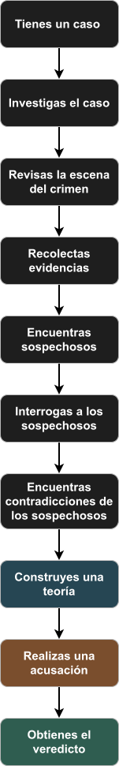
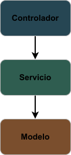

# Trace

## 🎮 Sobre Trace

**Trace** es un videojuego de investigación en el que el jugador debe resolver diferentes casos mediante
la exploración de escenas, análisis de evidencias e interrogatorios.

El jugador no recibe directamente la solución. Debe reunir información, encontrar contradicciones y construir
una teoría antes de tomar una decisión.

## Características

- 🔎 Investigación de escenas
- 📁 Recolección y análisis de evidencias
- 👤 Interrogación de sospechosos
- 🧠 Construcción de teorías
- ⚖️ Acusaciones y veredictos 
- 📚 Múltiples casos

---

## 🕵️ Cómo se juega

El ciclo principal de investigación sigue este flujo:



---

## 🕵️ Flujo de investigación

El jugador debe investigar el caso, reunir información y relacionar las diferentes pistas antes de tomar una decisión.

### 1. 📁 Tienes un caso

El jugador recibe un nuevo caso con información inicial sobre lo ocurrido, incluyendo
el contexto, la ubicación y los datos conocidos hasta ese momento.

### 2. 🔎 Investigas el caso

El jugador comienza la investigación y consulta la información disponible para determinar
qué lugares, personas y elementos pueden ser relevantes.

### 3. 🏠 Revisas las escenas

El jugador explora las escenas relacionadas con el caso para localizar elementos que pueden
aportar información.

### 4. 📌 Recolectas evidencias

Los elementos relevantes encontrados durante la investigación se incorporan al conjunto de evidencias
del caso. Estas pueden ayudar a confirmar o cuestionar las declaraciones de los sospechosos.

### 5. 👤 Encuentras sospechosos

A partir de la información obtenida, el jugador identifica a las personas relacionadas con el caso
y puede comenzar a investigar sus posibles vínculos con los acontecimientos.

### 6. 💬 Interrogas a los sospechosos

El jugador realiza preguntas a los sospechosos para obtener sus versiones de los hechos y descubrir
información que pueda ser relevante para la investigación.

### 7. ⚠️ Encuentras contradicciones

El jugador compara las declaraciones obtenidas durante los interrogatorios con las evidencias
encontradas. Las diferencias entre ambas pueden revelar contradicciones o mentiras.

### 8. 🧠 Construyes una teoría

Con la información recopilada, el jugador relaciona evidencias, declaraciones y contradicciones 
para construir una posible explicación de lo ocurrido.

### 9. ⚖️ Realizas una acusación

Cuando el jugador considera que tiene suficiente información, selecciona al sospechoso que considera
responsable y presenta su acusación.

### 10.  🔎 Obtienes el veredicto

El juego analiza la decisión del jugador con respecto a los acontecimientos reales del caso y muestra
el resultado de la investigación.

> **El objetivo no es simplemente encontrar al culpable, sino construir una teoría que explique cómo
> ocurrieron los hechos y utilizar las evidencias para respaldar la acusación.**

--- 

## Tecnologías

| Tecnología | Uso                                   |
|------------|---------------------------------------|
| Java       | Lenguaje principal                    |
| JavaFX     | Interfaz gráfica                      |      
| FXML       | Diseño de vistas                      |
| CSS        | Estilos visuales                      |
| Maven      | Gestión y construcción del proyecto   |
| CodevaUI   | Componentes de interfaz reutilizables |

---

## ⚙️ Requisitos 

Para ejecutar Trace necesitas:

- Java 21 o superior
- Maven
- Git

## 🧩 Arquitectura 

Trace utiliza una arquitectura organizada por responsabilidades:



### Controlador

Gestiona la interacción entre la interfaz y el usuario.

### Servicio

Contiene la lógica relacionada con la investigación y el funcionamiento de los casos.

### Modelo

Representa los elementos principales del juego, como casos, sospechosos y evidencias.

---

## 📋 Estado del proyecto

🚧 Trace se encuentra actualmente en desarrollo.

Actualmente:

- [x] Configuración inicial del proyecto
- [ ] Estructura base
- [ ] Pantalla de inicio
- [ ] Sistema de casos
- [ ] Sistema de investigación
- [ ] Sistema de evidencias
- [ ] Interrogatorios
- [ ] Sistema de teorías
- [ ] Veredictos

---

## 🗺️ Roadmap

### v0.1.0 - Base

- [ ] Proyecto JavaFX
- [ ] Pantalla principal
- [ ] Navegación
- [ ] Integración de CodevaUI

### v0.2.0 - Casos

- [ ] Sistema de casos
- [ ] Información del caso
- [ ] Sospechosos
- [ ] Ubicaciones

### v0.3.0 - Investigación

- [ ] Escenas
- [ ] Evidencias
- [ ] Notas
- [ ] Investigación

### v0.4.0 - Interrogatorios

- [ ] Sistema de preguntas
- [ ] Respuestas
- [ ] Contradicciones

### v0.5.0 - Resolución

- [ ] Teorías
- [ ] Acusaciones
- [ ] Veredictos
- [ ] Finales

### v1.0.0 - Primer caso completo

- [ ] Caso #001
- [ ] Pulido visual
- [ ] Sonido
- [ ] Versión jugable

---

## 🤝 Contribuir

Las contribuciones son bienvenidas.

Para contribuir:

1. Realiza un fork del proyecto.
2. Crea una rama para tus cambios.
3. Realiza tus modificaciones.
4. Crea un commit.
5. Abre un Pull Request.

### Convención de commits

```
feat: nueva funcionalidad
fix: corrección de errores
style: cambios visuales
refactor: reorganización del código
docs: cambios en documentación
```

---

## 📄 Licencia

Trace está distribuido bajo la licencia `Apache 2.0`.

Consulta el archivo LICENSE para obtener más información.

---

> Construido con ☕ y Java por **Codeva Studio**.


